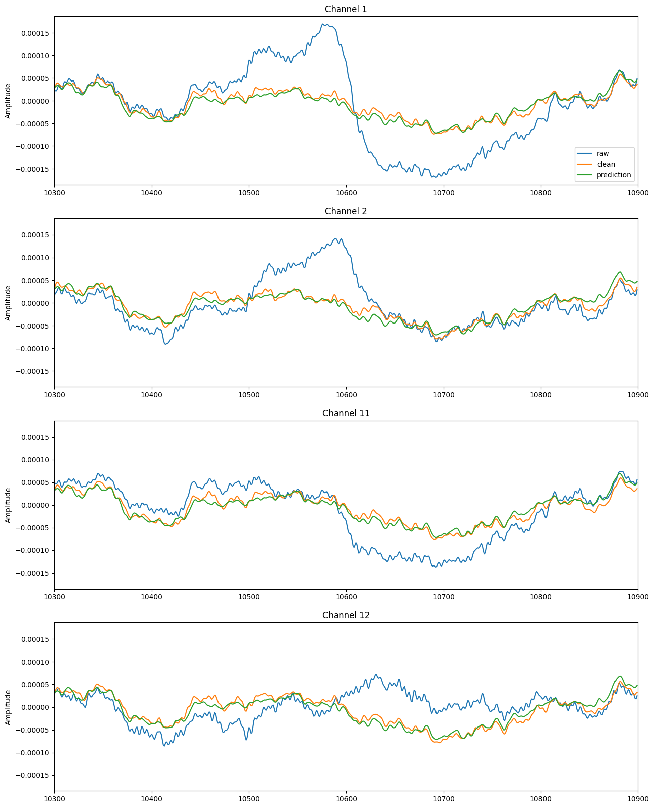
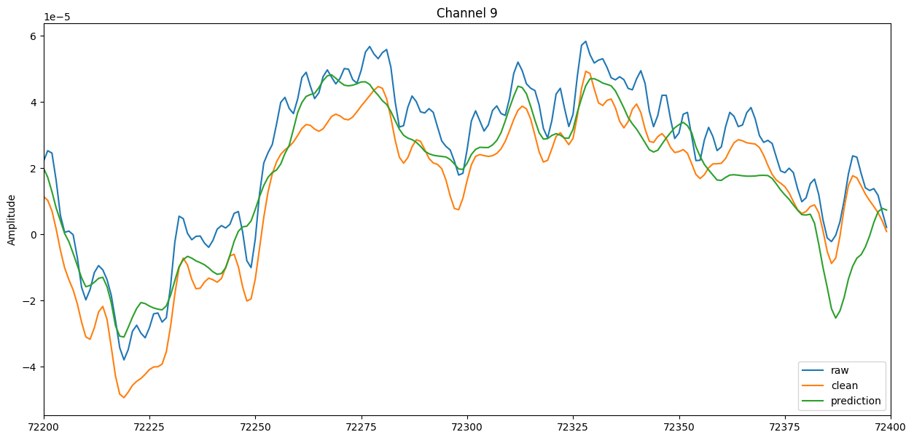
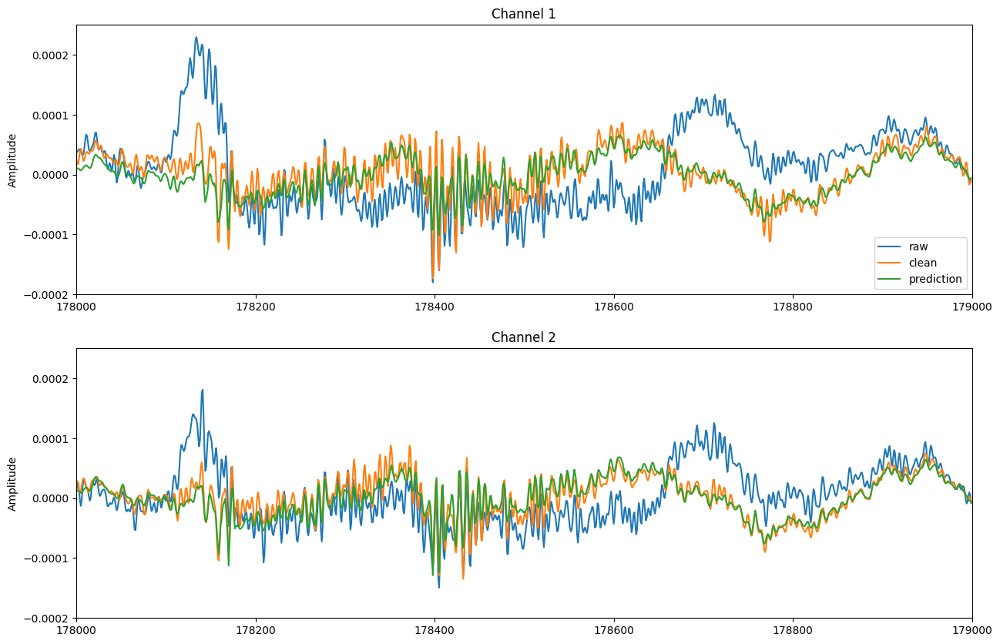

# BRIa Automated Preprocessing of EEG Documentation

Author: Bc. Andrea Chimenti  
Contact: `xchime00@stud.fit.vutbr.cz`  
Date: Autumn 2023

The aim of this project was to design an develop a deep learning method for automated preprocessing of eeg data. The input of the model is raw eeg data and the output is a prediction of clean and denoised eeg data.

## Data preparation

### Dataset

The dataset used in this project was *A Dataset of Scalp EEG Recordings of Alzheimer’s Disease, Frontotemporal Dementia and Healthy Subjects from Routine EEG* (available from [MDPI](https://www.mdpi.com/2306-5729/8/6/95)).

The dataset consists of 88 recordings of different subjects. The recordings have 19 channels, were sampled  at 500Hz and each of them is around 13 minutes long. All the recordings are available both as raw and clean.

Out of the 88 recordings only 15 are continuos and not corrupted. For simplicity the other recordings were not used in this project. The records were split in the following order:

Indexes of training data:
1, 5, 20, 37, 43, 57, 65, 67, 76, 82, 83

Indexes of validation data:
2, 44, 70, 84

### Channels

Order of the channels in the dataset. Preserved during training and visualization.

1. Fp1
1. Fp2
1. F3
1. F4
1. C3
1. C4
1. P3
1. P4
1. O1
1. O2
1. F7
1. F8
1. T3
1. T4
1. T5
1. T6
1. Fz
1. Cz
1. Pz

### Preprocessing

Before feeding the data into the model, some operations were performed on both raw and clean data:

- Resampling to 250Hz
- Application of band-pass filter (0.5Hz - 45Hz)
- Segmentation of data into epochs (len=2s, overlap=1)

Then the data were saved into numpy vectors with dimensions NUM_OF_CHANNELS*EPOCHS.

## Architecture

The process of training is controlled by the script in the file `main.py`. The data is prepared using

### Model

The model trained to perform the regression task id defined by the class `DenoiseCNN`. The model takes advantage of convolutional neural networks and its ability to capture spatial and temporal patterns and extract relevant features for the denoising task.

```py
class DenoiseCNN(nn.Module):
    def __init__(self):
        super(DenoiseCNN, self).__init__()

        self.net = nn.Sequential(
            nn.Conv1d(19, 32, kernel_size=3, padding=1),
            nn.LeakyReLU(0.15),
            nn.Conv1d(32, 64, kernel_size=3, padding=1),
            nn.LeakyReLU(0.15),
            nn.Conv1d(64, 128, kernel_size=3, padding=1),
            nn.LeakyReLU(0.15),
            nn.Conv1d(128, 256, kernel_size=3, padding=1),
            nn.LeakyReLU(0.15),
            nn.Conv1d(256, 512, kernel_size=3, padding=1),
            nn.LeakyReLU(0.15),
            nn.Conv1d(512, 1024, kernel_size=3, padding=1),
            nn.LeakyReLU(0.15),
            nn.ConvTranspose1d(1024, 512, kernel_size=3, stride=1, padding=1),
            nn.LeakyReLU(0.15),
            nn.ConvTranspose1d(512, 256, kernel_size=3, stride=1, padding=1),
            nn.LeakyReLU(0.15),
            nn.ConvTranspose1d(256, 128, kernel_size=3, stride=1, padding=1),
            nn.LeakyReLU(0.15),
            nn.ConvTranspose1d(128, 64, kernel_size=3, stride=1, padding=1),
            nn.LeakyReLU(0.15),
            nn.ConvTranspose1d(64, 19, kernel_size=3, stride=1, padding=1),
        )
```

*Due to lack of powerful hardware, only a small network was proposed and tested.*

### Training

The training process is driven by the script `main.py`. The training was performed on 890 epochs, the batch size was 32. The state_dict of the model can be loaded from the file `DenoiseCNN.pth`.

### Technologies

Python 3.11.5  
Pytorch 2.1.1  
GPU GTX 1050 Ti  

## Evaluation

The model successfully detects and corrects eeg artifacts, mainly EOG and EMG. The evaluation was performed on data that was not used for training.

### Regression metrics

Measures for recording sub-044.

|Elec.| R2   | MAE      |      MSE | RMSE     |
|-----|------|----------|----------|----------|
|Mean | 0.90 | 8.02e-06 | 1.06e-10 | 1.02e-05 |
|   0 | 0.90 | 8.11e-06 | 1.06e-10 | 1.03e-05 |
|   1 | 0.88 | 8.92e-06 | 1.27e-10 | 1.13e-05 |
|   2 | 0.90 | 7.66e-06 | 9.56e-11 | 9.78e-06 |
|   3 | 0.87 | 8.98e-06 | 1.29e-10 | 1.13e-05 |
|   4 | 0.93 | 6.21e-06 | 6.36e-11 | 7.98e-06 |
|   5 | 0.91 | 7.35e-06 | 8.82e-11 | 9.39e-06 |
|   6 | 0.92 | 7.28e-06 | 8.63e-11 | 9.29e-06 |
|   7 | 0.92 | 7.08e-06 | 8.15e-11 | 9.03e-06 |
|   8 | 0.85 | 1.02e-05 | 1.72e-10 | 1.31e-05 |
|   9 | 0.85 | 1.02e-05 | 1.70e-10 | 1.30e-05 |
|  10 | 0.91 | 7.65e-06 | 9.49e-11 | 9.74e-06 |
|  11 | 0.89 | 8.42e-06 | 1.13e-10 | 1.06e-05 |
|  12 | 0.91 | 7.42e-06 | 9.49e-11 | 9.74e-06 |
|  13 | 0.91 | 7.27e-06 | 8.57e-11 | 9.26e-06 |
|  14 | 0.89 | 8.55e-06 | 1.19e-10 | 1.09e-05 |
|  15 | 0.91 | 7.58e-06 | 9.32e-11 | 9.66e-06 |
|  16 | 0.89 | 8.13e-06 | 1.06e-10 | 1.03e-05 |
|  17 | 0.90 | 7.87e-06 | 9.98e-11 | 9.99e-06 |
|  18 | 0.91 | 7.63e-06 | 9.47e-11 | 9.73e-06 |

### EOG correction

The EOG artifact in channel 1 is completly removed. Other 3 channels were the correction was the strongest were listed in the picture.



### EMG correction

The high frequency present in the raw signal is being removed by the signal. High frequencies are associated with EMG artifacts.



Another example of muscle artifacts. Notice the scale of the x axis.



## Conclusion

The model performs fairly well when used on unseen data from the same dataset. This could mean that the model is well suited for the task but it does not guarantee that the model performs well in generalization. Since the data is similar, the model could be overfitting. For this reason it is important to test the model on different datasets before using in production.
